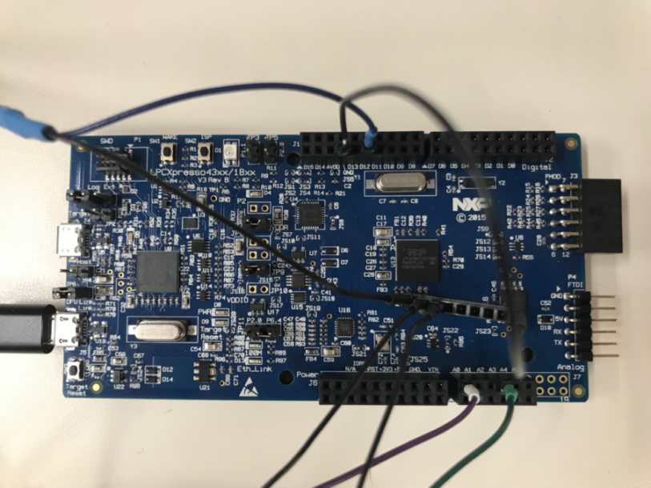

# LPC43xx_M4_AnalogToDigital
Convert Analog(0-3.3V) Input(Ch3) to Digital(0-5V, Active-High) Output(P1_3, GPIO0[10]) on [LPCXpresso43xx Development Board](https://www.nxp.com/support/developer-resources/evaluation-and-development-boards/lpcxpresso-boards/lpcxpresso43s67-development-board:OM13084)

In the 5s period after board power up or reset, threshold will be auto-adjusted according to the range of the analog input(check photodiode polarity, make sure input in maximum range, tested on [OSRAM BPW21](https://www.osram.com/os/ecat/Metal%20Can®%20TO39%20Ambient%20Light%20Sensor%20BPW%2021/com/en/class_pim_web_catalog_103489/global/prd_pim_device_2219533)), then digital output will be triggered using learned threshold. The digitized analog input will also be sent to analog output(Ch0).

